# Web VM

## Architecture



**Web VM** を **POSIX 準拠の最小 UNIX 互換 OS** としてブラウザ上に実装するためのアプローチ:

> ChatGPT 君に文章を綺麗にしてもらったり情報ソースを調べてもらったりした。ありがとう...

---

### 0. 前提と共通ポリシー

| 項目 | 方針 |
| --- | ---- |
| ブラウザ | **Firefox 138 相当 (2025 年 5 月)** |
| C ランタイム | `clang -target wasm32-unknown-unknown` + `musl‐libc` を最小改造 (WASI 0.2 にマップ) |
| WASM 機能 | GC (全主要ブラウザで標準化済) / Threads / Multiple Memory などを使用可 ([Uno Platform][1]) |
| POSIX API | SUS 必須コール 260 個のうち、ブラウザで実装不可能な "`fork`, `mmap(PROT_EXEC)`..." を除き **約 220 個**を提供 |
| マルチタスク | Web Worker + `SharedArrayBuffer` (COOP/COEP 必須) で pthread 互換 ([MDN Web Docs][2]) |
| VFS 永続化 | IndexedDB (origin-private) ＋ OPFS/FS Access は実験フラグで後付け ([MDN Web Docs][3]) |
| グラフィクス | WebGL 2 をデフォルト。WebGPU は非対応なので抽象レイヤに隠蔽 ([LambdaTest][4]) |

> `fork(2)` だけは JS/WASM で実装不可、代替として `posix_spawn()` 相当を実装し既存の Unix ツールをビルド時に `fork()->posix_spawn()` へ変換するパッチを当てる

### 1. ブートストラップ & ローダー (JS)

1. HTML エントリに `<script type="module" src="boot.js"></script>` を配置
2. `boot.js` で

   ```js
   const {instance, module} = await WebAssembly.instantiateStreaming(
       fetch("/kernel.wasm"), { /* imports (syslib) */ });
   instance.exports._start();  // WASI 起動点
   ```

3. ロード後に `navigator.storage.persist()` を呼び IndexedDB を **persistent** 扱いで確保 (Firefox では最大 50 % / 8 TiB 上限) ([MDN Web Docs][3])。

---

### 2. カーネル (C + Wasm GC)

#### 2-1. メモリモデル

| 領域 | 特徴 | 実装 |
| --- | --- | ---- |
| **linear mem0** | musl 用ヒープ/スタック | `--import-memory --shared` で生成 |
| **gc-heap** | `ref struct` による長期オブジェクト | `-fwasm-experimental-gc` を有効化 (clang 17+) ([Uno Platform][1]) |
| **mem1** | VGA バッファ相当 (GUI 共有) | `memory(shareable, 64MiB)` で JS と共有 |

#### 2-2. スレッド/スケジューラ

* **pthread** を musl の `libpthread` そのまま使用。
* `pthread_create()` 内部で

  ```c
  emscripten_proxying_queue(queue, worker_post_func, arg);
  ```

  を呼び、Dedicated Worker を生成
* `futex_wait`/`futex_wake` は `Atomics.wait`/`notify` にマップ。([MDN Web Docs][2])
* タイムスライスは JS 側 `setInterval()` で 4 ms ごとに `Atomics.notify` → 協調的プリエンプション

#### 2-3. システムコールディスパッチ

SUS 必須コールを **WIT** で宣言し、`wit-bindgen c` がスタブを生成。

例 (抜粋):

```wit
package sys.fs
world posix {
  import func open(path: string, flags: u32) -> s32
  import func read(fd: s32, buf: list<u8>) -> s32
  ...
}
```

([component-model.bytecodealliance.org][5], [GitHub][6])

C 側は

```c
__attribute__((import_module("fs"), import_name("open")))
extern int32_t fs_open(const char*, uint32_t);
```

### 3. デバイスドライバ層 (syslib.ts)

| ドライバ | Firefox 実装 | kernel への export |
| ------ | ------------ | ----------------- |
| **fs.ts** | IndexedDB + OPFS(behind `dom.fs.enabled`)  | `fs_open/read/write/seek` |
| **net.ts** | WebTransport (HTTP/3) → fallback WebSocket | `net_socket/connect/send/recv` ([MDN Web Docs][7]) |
| **audio.ts** | AudioWorklet + SAB ring buffer | `audio_write(buffer)` |
| **hid.ts** | WebHID/WebUSB (要 HTTPS) | `hid_control(msg)` |

#### IndexedDB 実装

* ブロックサイズ 4 KiB, object-store `blocks{id, data}`
* 書込みは `put()`、読みは `get()`。Batch 用に `getAllRecords()` を使用しシークを高速化 (Firefox 2024 Q4 実装) ([MDN Web Docs][3])
* キャッシュ LRU を GC heap で保持し一定閾値で `navigator.storage.estimate()` を確認

### 4. ファイルシステム (VFS)

```
/          (ramfs) ──┐
 ├─ /usr   (pkgfs) ──┤  ← gzip + tar を起動時に展開
 ├─ /home  (idbfs) ──┤
 └─ /tmp   (memfs) ──┘
```

* **idbfs**: block device → IndexedDB, メタは ramfs にキャッシュ
* **pkgfs**: read-only squashfs 風, `fetch` で `*.squash.wasm` を lazy-mount
* `statvfs()` は `navigator.storage.estimate()` を呼び残容量を返す

### 5. ネットワークスタック

#### 5-1. ソケット API

* `socket(AF_INET, SOCK_STREAM, 0)` → `WebTransportDatagramDuplexStream`
* `SOCK_DGRAM` → unreliable datagram モード
* `setsockopt(TCP_NODELAY)` は NOP

#### 5-2. 名前解決

* `getaddrinfo()` を JS で `fetch('https://dns.google/resolve?name=...&type=AAAA')` に委譲
  → 実サーバと CORS 許可が要るため (デフォルトは) ローカルキャッシュで即応

### 6. オーディオサブシステム

```
kernel (C)  ---- SAB[ring] ----  audio.ts  ---- AudioWorklet ---- HW
```

* 128 sample (約 2.9 ms) のリングバッファを共有
* `audio_write()` はノンブロッキングで不足時 `EAGAIN`
* AudioWorklet 内部で `Atomics.waitAsync()` を利用した pull
* Firefox の AudioWorklet では 128/256/512 のみサポート, 低遅延が必要なら 256 sample を選択

### 7. GUI / ウィンドウマネージャ

#### 7-1. ウィンドウ = `<div class="window" data-id="pid">`

```html
<div class="window" style="left:10px;top:10px;width:640px;height:480px">
  <canvas width="640" height="480"></canvas>
  <span class="title">vim /etc/passwd</span>
</div>
```

* CSS 変換 (`transform: translate()`) でドラッグ
* ズーム・最小化は `display:none` 切替
* Canvas は OffscreenCanvas + WebGL 2
* 画像/動画は ``/`<video>` を内包して高速パスへ → レンダラは kernel に "BlitSprite" 要求を送信し syslib が DOM を生成

#### 7-2. フォーカス・イベント

* `click` → `focus(pid)` syscall
* キー入力は `keydown` → `postMessage(workerPort, {type:'key',code})`

### 8. IPC & シグナル

| 機構 | 実体 | 対応 API |
| --- | --- | -------- |
| pipe | `MessageChannel` (2 ports) | `read`/`write` |
| UNIX domain socket | `SharedArrayBuffer + futex` | `sendmsg`/`recvmsg` |
| signal | `Atomics.notify` + `sigaction` table | `kill`, `sigwait` |

### 9. ビルド & デバッグ手順

```bash
# ビルド
clang --target=wasm32 -O2 -pthread \
      -mexec-model=reactor -mthreads \
      -fwasm-experimental-gc \
      -nostdlib -Wl,--export=_start \
      -Wl,--import-memory -Wl,--shared-memory \
      -o kernel.o -c kernel.c

wasm-ld kernel.o --export-dynamic -o kernel.wasm

wit-bindgen c --import world.wit --out-dir bindings
```

* **ユニットテスト**: `wasmtime --preview2 kernel.wasm --env FSI=idb-mock` で CLI テスト ([Bytecode Alliance][8])
* **ブラウザデバッグ**: `about:debugging#workers` で Worker を選択し wasm シンボル確認

### 10. 拡張と将来対応

| 機能 | 現状 | 将来 |
| --- | --- | ---- |
| **WebGPU** | Firefox 非対応 → 抽象 `gfx_device` を通じ WebGL2 実装に固定 ([LambdaTest][4]) | `gfx_device_webgpu` モジュールを後日ロード |
| **WASI 0.3 (async)** | 2025 H1 リリース予定 | `async open/read` をネイティブ化すると I/O 速度向上 ([Uno Platform][1]) |
| **OPFS** | hidden flag | `navigator.storage.getDirectory()` で大容量ストレージ |

[1]: https://platform.uno/blog/state-of-webassembly-2024-2025/ "The State of WebAssembly – 2024 and 2025"
[2]: https://developer.mozilla.org/en-US/docs/Web/JavaScript/Reference/Global_Objects/SharedArrayBuffer "SharedArrayBuffer - JavaScript | MDN"
[3]: https://developer.mozilla.org/en-US/docs/Web/API/Storage_API/Storage_quotas_and_eviction_criteria "Storage quotas and eviction criteria - Web APIs | MDN"
[4]: https://www.lambdatest.com/web-technologies/webgpu-firefox "Browser Compatibility of webgpu on Firefox Browsers"
[5]: https://component-model.bytecodealliance.org/ "The WebAssembly Component Model: Introduction"
[6]: https://github.com/bytecodealliance/wit-bindgen "bytecodealliance/wit-bindgen: A language binding generator for ..."
[7]: https://developer.mozilla.org/en-US/docs/Web/API/WebTransport "WebTransport - Web APIs - MDN Web Docs - Mozilla"
[8]: https://bytecodealliance.org/articles/WASI-0.2 "WASI 0.2 Launched - Bytecode Alliance"
